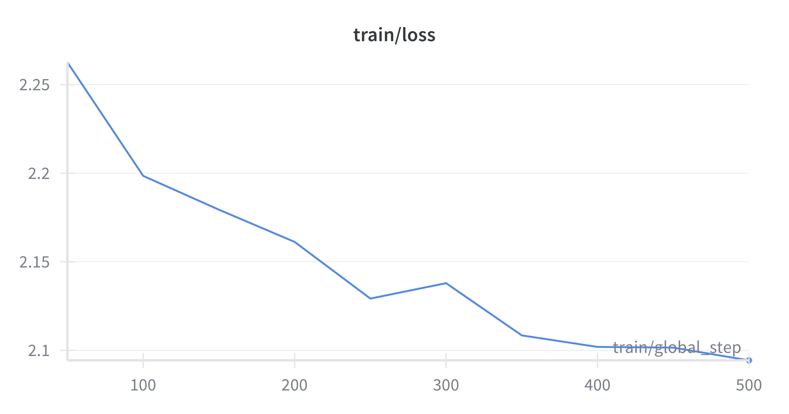

# Hemingway LLM

Fine tuning an LLM on Hemingway's work to generate Hemingway-like text.

## Introduction:

Hemingway is one of the most famous authors of the 20th century, and his style is characterized by its simplicity, directness, and clarity. He was awarded the 1954 Nobel Prize in Literature for his body of work and the Pulitzer Prize for Fiction in 1953 for his book "The Old Man and the Sea".

I personally enjoy reading Hemingway's work and I wanted to see if I could train an LLM on Hemingway's work to generate text that is similar to his style.

## Data

There are a few public domain books by Hemingway I gathered from Project Gutenberg. These include:
- A Farewell to Arms
- The Sun Also Rises
- Men Without Women
- In Our Time
- Three Stories & Ten Poems

The plain text files were then cleaned up to remove headers, footers, and other metadata and formatted into a collection of paragraphs that can be used as training data for the model.

## Training:

I ran the fine tuning using a google colab T4 GPU. The full training script is in the `train.ipynb` file.
I used the TinyLlama-1.1B-Chat as the base model, and fine tuned it for 500 steps.

Overall, the training took ~30 minutes to complete, with the following loss curve:

## Results:

The results are surprisingly good for a model that small. Not all examples are perfect and there are some outputs with non coherent text or repetitions, but overall the model does a good job of generating hemingway like text!

Since the original "The Old Man and the Sea" was not included in the training data, I thought it would be nice to go with the prompt "A short story: The Sea And The Old Man" and see what the model generates. Here's the result:

>**A short story: The Sea And The Old Man**
>
>The sea was the old man’s friend. The sea was the old man’s friend.
>
>He had been a good friend to the sea, but the sea had grown cruel,
>and the old man had not been able to stay with it. He had gone away
>and come back, and it was only when he had gone away again that he
>couldn’t stay with it.
>
>“What happened to you?” he asked the sea. 
>... 
>what happened to me.” 
>
>“You must have been very sick,” the sea said.
